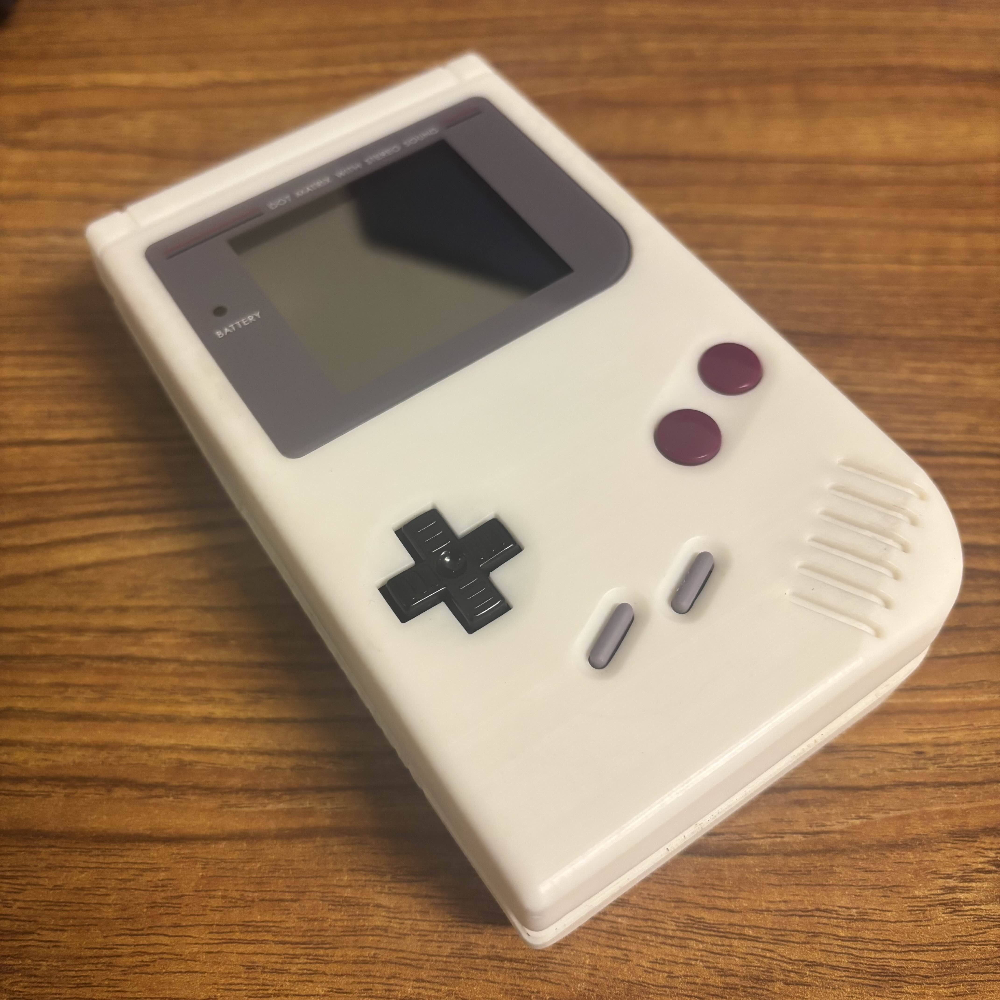
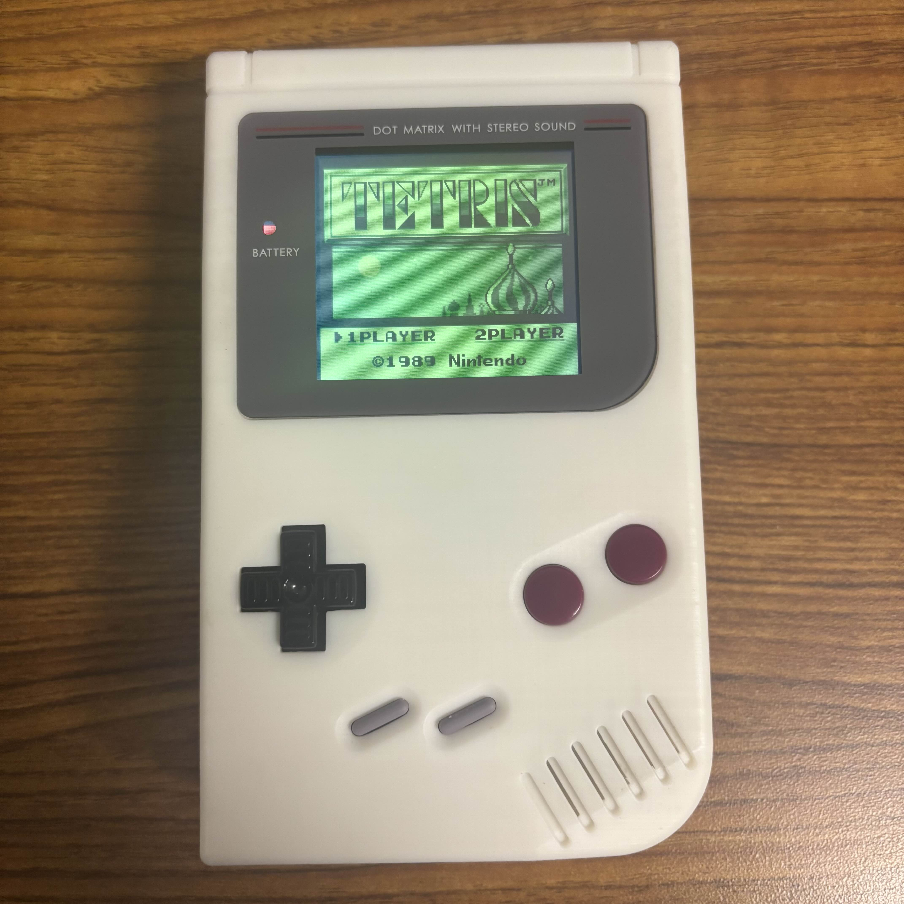

# Gameboy DMG Replica

By: Jacob Malin

  
  
  
  

  
  

A replica of the original Gameboy handheld (DMG-01). Complete with a hardcoded Tetris game recreated from scratch, a 3D-printed case with working buttons, and battery power. More specific information can be found in the paper: [GameBoy DMG 01.pdf](GameBoy_DMG_01.pdf).
